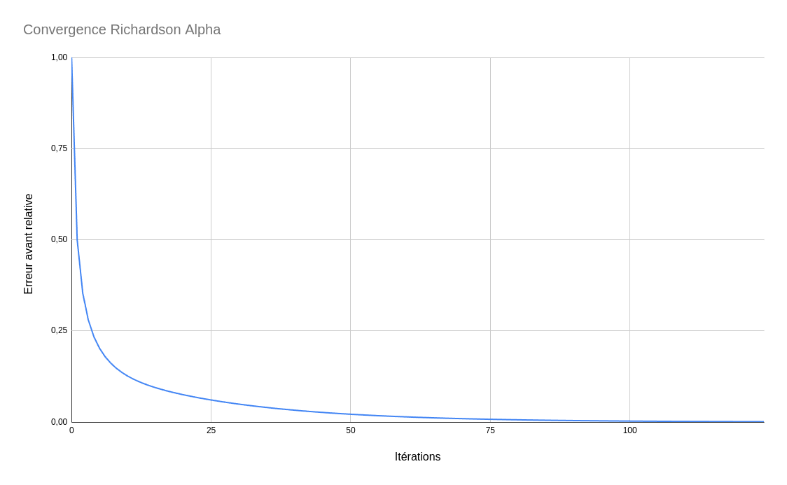
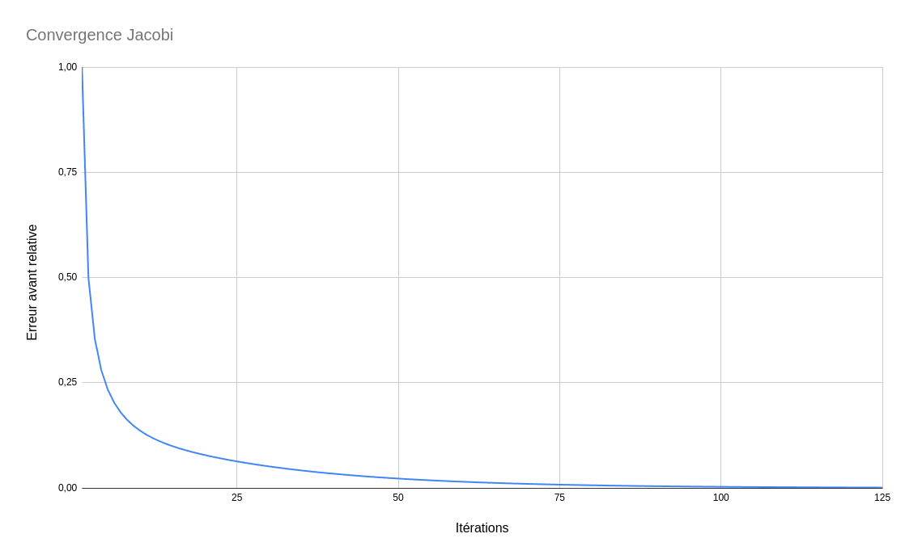

# Notations:
Pour les questions suivantes on a:
 - scalaires lettres grecques
 - vecteurs lettres latines minuscule
 - matrices lettres latines majuscule

# Méthode directe:

## Exercice 3

#### 1:
Comme un pointeur vers double (`double *` et non `double **`)
Par example pour une matrice n*m:
```C
double a[5][3] = {1,1,1,2,3,4,3,5,2,4,2,5,5,4,3};
```
ou:
```C
double *a = malloc(sizeof(double) * n * m)
```

---
#### 2:
C'est une macro qui permet d'indiquer à une fonction si une matrice est sockée par lignes ou par colones.

---
#### 3:
La leading dimension correspond a la taille des segments dans lesquels les éléments de la matrice sont continus en mémoire

---
#### 4:
Multiplication matrice-vecteur sur matrice bande.
$\alpha Ax + \beta y$

---
#### 5:
Factorisation LU de matrice bande en utilisant un pivot.
Replace les valeurs de la matrice A par LU.
Implémentation de BLAS3

---
#### 6:
Résolution d'un système linéaire sur une matrice factorisée LU.
$A\times X = B$

---
#### 7:
Résolution d'un système linéaire. 
Implémente DGBTRF et DGBTRS

---
#### 8:
formule du résidu:
$$r = b - A\hat{x}$$
norme résiduelle arrière:
$$\frac{||b - A\hat{x}||}{||A||||\hat{x}||}$$
norme résiduelle avant:
$$\frac{||r||}{||b||} = \frac{||b - A\hat{x}||}{||b||}$$

pour calculer la norme d'un vecteur `x`:
`n = sqrt(ddot(&n, x, 1, x, 1));`

pour $||x - \hat{x}||$:
`daxpy(&n, -1, x^, 1, x, 1);`


## Exercice 4:

### 2-3:
Soit un vecteur $x$ qu'aquedes1:
on a $AB x = y$ tel que y est un vecteur de nul avec des 1 à chaque extrémités 
$$
\begin{bmatrix}
 0 &-1 &-1 &-1 &-1  \\
 2 & 2 & 2 & 2 & 2  \\
-1 &-1 &-1 &-1 & 0 
\end{bmatrix}
\times
\begin{bmatrix}
1 \\
1 \\
1 \\
1 \\
1 
\end{bmatrix}=
\begin{bmatrix}
1 \\
0 \\
0 \\
0 \\
1 
\end{bmatrix}
$$

## Exercice 5:
### 1:
cf. code

### 2:

les temps mesurés pour l'execution de DGBSV par rapport à DGBTRF et DGBTRS sont similaires, ce qui est normal car DGBSV fait les appels à ces deux fonctions.

| valeurs de `la` | temps |
| --- | --- |
| 1000 | ~40000ns |
| 10000 | ~244000ns |
| 100000 | ~1300000ns |

On a donc une très bonne complexité (de l'ordre de $O(n)$), ce qui est expliqué par le stockage en bande des matrices.

## Exercice 6:

### 1:

cf. code

### 2:

On sait que $A=LU$, on peut donc effectuer cette multiplication de $L$ et $U$ pour vérifier qu'on obtient bien la matrice A originelle.

# Méthodes itératives:

## Méthode de Richardson alpha:

L'erreur avant semble décroître de manière logarithmique.

## Méthode de Jacobi:

De la même manière que pour Richardson, l'erreur avant relative décroît de manière logarithmique. En l'occurence, le résidu est le même pour les deux implémentations.

## Méthode de Gauss-Seidel:

Pour la méthode de Gauss-seidel le résidu diverge. J'ai fait de mon mieux mais j'ai pas trouvé l'erreur.

# Analyse de complexité

| fonction | complexité temps | complexité espace |
|---|---|---|
| **lib_poisson_1D.c** |
| dgbset_GB_operator_colMajor_poisson1Dtrf | O(la) | pas d'allocation |
| set_GB_operator_colMajor_poisson1D_Id | O(la*lab) | - |
| set_dense_RHS_DBC_1D | O(la) | - |
| set_analytical_solution_DBC_1D | O(la) | - |
| set_grid_points_1D | O(la) | - |
| relative_forward_error | O(la) | - |
| indexABCol | O(1) | - |
| dgbtrftridiag | O(n) | - |
| **lib_poisson_1D_richardson.c** |
| eig_poisson1D | O(la) | - |
| eigmax_poisson1D | O(1) | - |
| eigmin_poisson1D | O(1) | - |
| richardson_alpha_opt | O(1) | - |
| richardson_alpha | * | la |
| extract_MB_jacobi_tridiag | O(la) | - |
| extract_MB_gauss_seidel_tridiag | O(la) | - |
| richardson_MB | * | la |

Les fonctions ayant une complexité temporelle '*' ont une complexité variable, car elles dépendent de la convergence des méthodes de calculs.